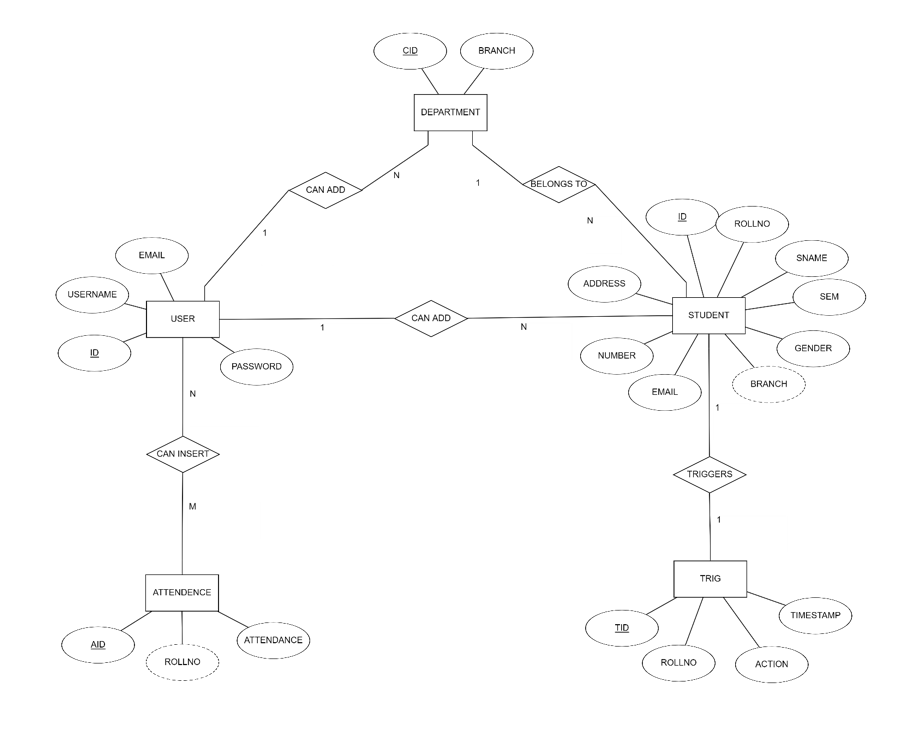

# Student Management System

## Project Overview
The **Student Management System** is a software application developed to manage various student-related activities in educational institutions. This system allows administrators to manage student records, track attendance, and streamline administrative processes. It reduces manual work and enhances data accuracy and accessibility by leveraging database management systems.

## Features
- **Admin Access:** Administrators can manage student records and add, edit, or delete details as needed.
- **Student Search:** Students can check their personal information and attendance using their roll number.
- **Attendance Management:** The system keeps track of student attendance and department-wise records.
- **Web-Based Interface:** The application is accessible via the internet, providing a centralized platform for managing student data.

## Technologies Used
- **Frontend:** HTML, CSS, JavaScript, Bootstrap
- **Backend:** Python Flask, SQLAlchemy (Python 3.7)
- **Database:** MySQL
- **Tools:** XAMPP, PyCharm, Sublime Text 3

## How It Works
1. **Login:** Administrators log in to manage student records and attendance.
2. **Student Management:** Admins can add, edit, or delete student details, while students can view their own information.
3. **Attendance Tracking:** Admins input attendance data, and students can check their attendance status using their roll number.
4. **Database Operations:** All data is securely stored in a MySQL database and accessed through Python Flask backend.
5. **User Interface:** The system provides an easy-to-use web interface for both administrators and students.

## Database Design
- **ER Diagram:** The system's ER diagram represents the relationships between different entities like students, departments, and attendance.

- **Schema Diagram:** Depicts how the tables are structured in the database.

|     |  |
|:-----------------------------------------------:|:---------------------------------------------------:|
| **ER Diagram**                                  | **Schema Diagram**                                  |

## Result
The **Student Management System** successfully automates administrative tasks such as managing student details and attendance. It enhances the overall efficiency of the institution, reduces the manual workload, and provides secure access to data. Below are the images showcasing the results of the web user interface, highlighting the system's functionality and user experience in action:

|  |  |
|:-------------------------------------------:|:-----------------------------------------------:|
| **Home Page**                               | **Student Page**                               |

|  |  |
|:------------------------------------------------:|:--------------------------------------------------------------:|
| **Details Page**                                 | **Database Records Page**                                     |

## Future Enhancements
- **AI and ML Integration:** Incorporating AI and machine learning features to analyze student performance and provide insights.
- **Biometric Integration:** Adding biometric attendance features for enhanced security.
- **Cloud Integration:** Moving the system to a cloud-based architecture for better scalability and data accessibility.

---